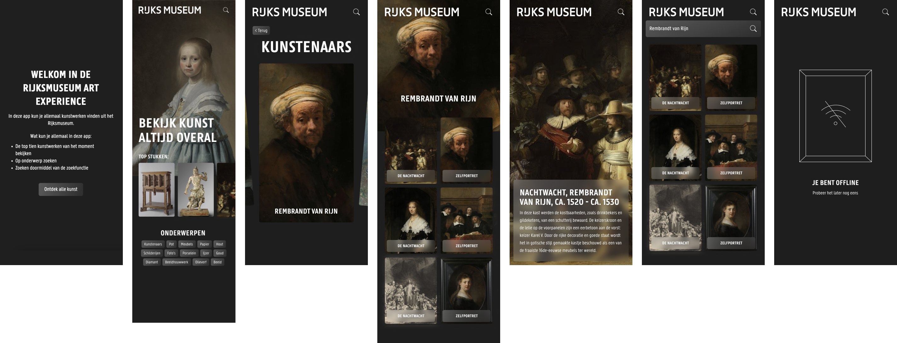
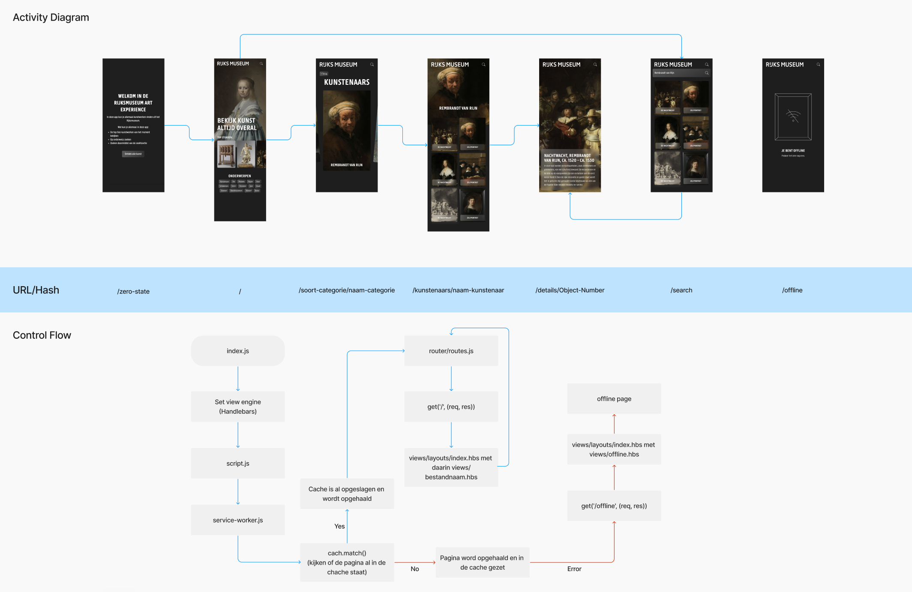
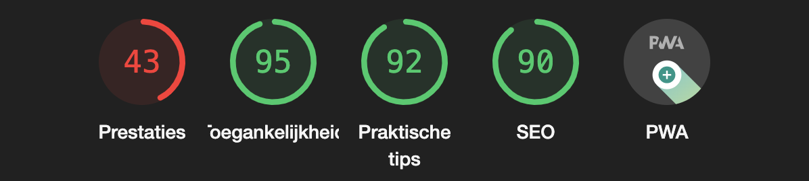
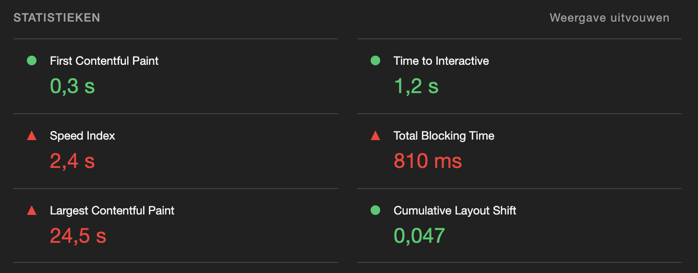
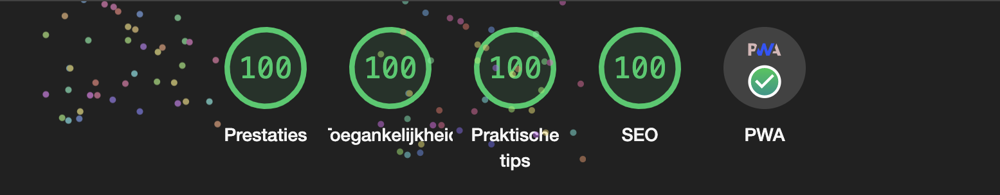
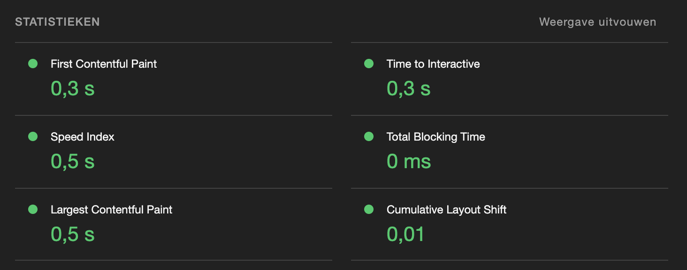

# Server side Rijksmuseum Art Experience

In deze repo kun je de server side versie van de Rijksmuseum Art Experience vinden. Dit project heb ik eerst gemaakt met het van Web App From Scratch voor de Minor Web Design & Development en heb ik nu omgezet naar een server side versie, met Node.js en Express.

Je kunt de live versie van de app [hier](https://rijksmuseum-art-experience.cyclic.app) vinden.



## Tabel of contents

- [Hoe installeer je dit project?](#hoe-installeer-je-dit-project)
- [Hoe gebruik je dit project?](#hoe-gebruik-je-dit-project)
- [Client-Server rendering](#client-server-rendering)
- [Activity diagram](#activity-diagram)
- [Service Worker](#service-worker)
- [Optimalisaties](#optimalisaties)
- [Wat heb ik allemaal gedaan?](#wat-heb-ik-allemaal-gedaan)
- [Bronnen](#bronnen)
- [License](#license)

## Hoe installeer je dit project?

Je kunt dit project installeren door een clone te maken van dit project. Hiervoor heb je Git nodig. Als je Git hebt geïnstalleerd, ga je eerst naar de map waar je dit project in wilt zetten. Daarna kun je het volgende commando's in je terminal typen:

1. `git clone https://github.com/Inevdhoven/PWA-Rijksmuseum-Art-Experience.git`

2. `cd PWA-Rijksmuseum-Art-Experience`

3. `npm install`

4. Maak een key aan om de [Rijksmuseum API](https://www.rijksmuseum.nl/nl/rijksstudio/) te kunnen gebruiken. Dit kun je doen door naar je profiel te gaan en dan naar instellingen daar kun je een key aanmaken.

5. Maak een .env bestand aan in de root van het project en voeg hier je key toe. Er moet het volgende in komen te staan: `API_KEY = 'YOUR_API_KEY'`

6. Zet het .env bestand in de gitignore.

7. `npm run start`

8. Nu kun je het project bekijken op `http://localhost:3000/`

## Hoe gebruik je dit project?

Deze versie van de Rijksmuseum Art Experience is een progressive web app, dit betekent dat de app server sitde wordt gerenderd. Dit betekent ook dat je de app kan downloaden op mobiel en desktop door op het download icoontje in de browserbalk te klikken of op telefoon op add to home screen te klikken.

Wanneer je de webapp opent kom je op de homepage. Hier kun je de top 10 kunstwerken bekijken, deze verander om de paar dagen. Hierdoor blijft het leuk om ernaar te kijken. Je kunt ook op onderwerp zoeken, zoals schilderijen, potten of meubels. Daarnaast kun je ook naar een specifiek kunstwerk zoeken, door bovenin op het zoek icoontje te klikken. Wanneer je op een kunstwerk klikt, kom je op een detailpagina waar je meer informatie over het kunstwerk kunt lezen.

## Client-Server rendering choices

Voor het vak Web App From Scatch heb ik de Rijksmuseum Art Experience eerst gemaakt met client side rendering. Dit betekent dat alles via de browser wordt gerenderd. De browser vraagt alle data op en deze wordt dan gerenderdeerst wordt er een HTML bestand opgehaald en deze wordt dan verder gerenderd doormiddel van JavaScript. Doordat alles door de browser wordt gerenderd, wordt de content pas zichtbaar wanneer hij klaar is met laden. Als een gebruiker minder goed internet heeft kan dit dus veel langer duren dan bij iemand met een snellere verbinding.

Nu voor het vak Progressive Web App heb ik de app omgezet naar server side rendering. Bij serverside rendering is de server verantwoordelijk voor het renderen van alles, wat daarna naar de client wordt gestuurd. Dit kan ervoor zorgen dat het laden van de pagina veel sneller gaat dan bij client side rendering. Dit komt doordat de browser direct de HTML bestanden kan laden en deze niet eerst hoeft te renderen.

## Activity diagram



## Service Worker

De service worker is een script dat in de achtergrond draait en ervoor zorgt dat de app offline te gebruiken is. De service worker wordt geïnstalleerd wanneer de gebruiker de app voor het eerst opent. De service worker zorgt ervoor dat de app offline te gebruiken is. Dit doet hij door de assets die de app nodig heeft op te slaan in de cache, deze kun je terug vinden wanneer je de app inpecteert onder App en dan onder Chache-opslag aan de zijkant, daarna klik je op offline-v1. De service worker zorgt er ook voor dat alle pagina's waar de gebruiker al is geweest worden opgeslagen in de cache, zodat wanneer de gebruiker offline gaat deze nog te gebruiken zijn. Deze pagina's worden ook onder Chache-opslag opgeslagen. Wanneer de gebruiker offline is en op een pagina komt die niet in de cache staat, wordt er een offline pagina getoond.

Door de service worker is het niet mogelijk dat je met een cookie opslaat dat je al op een bepaalde pagina bent geweest, dit komt omdat je niet bij de cookie kan komen. Dit heb ik er wel in zitten, zodat wanneer de service-worker uit staat de website het nog wel doet. Dit heb ik gedaan door de zero-state op /zero-state te plaatsen inplaats van op / en de homepage staat nu op / en niet op /home. Dus nu staat de home echt op de homepage wat beter is dan dat er naar een andere pagina word geleid.

## Optimalisaties

Bij het optimaliseren van mijn Progressive Web App heb ik eerst via lighthouse gekeken wat op dat moment de score was. Hierbij krijg je namelijk ook precies te zien wat er allemaal verbeterd kan worden. Op de volgende twee afbeeldingen kun je zien wat er al goed ging en wat er nog verbeterd moest worden.




De prestaties van de app waren erg slecht door de afbeeldingen, deze waren namelijk erg groot. Daarnaast waren bij toegangelijkheid niet alle button voor te lezen door de screenreader, omdat er geen tekst in stond. Bij praktische tips moest ik ervoor zorgen dat er geen error meer in de console terecht kwamen en bij SEO moest ik een meta description toevoegen.

Bij het kopje PWA waren er nog verschillende dingen die ik nog moest toevoegen:

- Ik moest de volgende regel nog toevoegen aan mijn manifest.json: `"purpose": "any maskable"`
- In de head van mijn HTML moest ik nog twee meta tags toevoegen: `<meta name="theme-color" content="#1f1f1f">` en `<link rel="apple-touch-icon" href="/images/icon-384x384.png">`

Om de afbeeldingen te optimaliseren heb ik voor Handlebars een helper geschreven die ervoor zorgt dat hij het juiste formaat afbeelding pakt wanneer de gebruiker een bepaalde schermgrootte heeft. Hierdoor worden ze niet groter dan nodig is. Dit heb ik gedaan met de volgende code:

```javascript
helpers: {
    replaceS0: function (url) {
        if (url.includes('=s0')) {
            return url.replace('=s0', '=s500');
        }
        return url;
    },
    replaceS1: function (url) {
        if (url.includes('=s0')) {
            return url.replace('=s0', '=s900');
        }
        return url;
    },
    replaceS2: function (url) {
        if (url.includes('=s0')) {
            return url.replace('=s0', '=s1200');
        }
        return url;
    },
    replaceS3: function (url) {
        if (url.includes('=s0')) {
            return url.replace('=s0', '=s1500');
        }
        return url;
    },
    replaceS4: function (url) {
        if (url.includes('=s0')) {
            return url.replace('=s0', '=s300');
        }
        return url;
    },
}
```

```html
<picture>
  <source media="(max-width: 499px)" srcset="{{replaceS0 hero.webImage.url}}" />
  <source media="(min-width: 500px)" srcset="{{replaceS1 hero.webImage.url}}" />
  <source
    media="(max-width: 1024px)"
    srcset="{{replaceS2 hero.webImage.url}}"
  />
  
</picture>
```

Deze code zorgt ervoor dat wanneer de gebruiker een schermgrootte heeft van 500px of kleiner, de afbeelding met de url `=s500` wordt gebruikt. Wanneer de gebruiker een schermgrootte heeft van 501px of groter, wordt de afbeelding met de url `=s900` gebruikt. Dit gaat zo door tot de afbeelding met de url `=s300` wordt gebruikt wanneer de gebruiker een schermgrootte heeft van 1024px of kleiner.

Verder heb ik ook nog mijn font geoptimaliseerd door er `display: swap;` aan toe te voegen dit zorgt ervoor dat de tekst bijna meteen wordt getoond in het fallback font en daarna in het custom font. Dit zorgt ervoor dat de gebruiker niet lang hoeft te wachten op de tekst.

Mijn CSS heb ik geminified met de package genaamd minify. Hierdoor is mijn CSS een stuk kleiner geworden. Wat er ook weer voorzorgt dat de app sneller laad.

Als laatste heb ik ook nog chache-control toegevoegd aan mijn server. Dit heb ik gedaan met de volgende code:

```javascript
app.use((req, res, next) => {
  res.setHeader("Cache-Control", "max-age=" + 60 * 60 * 24 * 365);
  next();
});
```

Al de hierboven genoemde punten hebben ervoor gezorgd dat mijn app een stuk sneller laad en een stuk beter scoort op lighthouse. Hieronder kun je zien wat de scores zijn na de optimalisaties.




## Wat heb ik allemaal gedaan?

| TO DO                                                      | STATUS             |
| ---------------------------------------------------------- | ------------------ |
| Refactor WAFS to server side version met Node.js & Express | :white_check_mark: |
| App omzetten van client side naar server side              | :white_check_mark: |
| Tooling toevoegen                                          | :white_check_mark: |
| Manifest toevoegen                                         | :white_check_mark: |
| Service Worker toevoegen                                   | :white_check_mark: |
| Het maken van een activity diagram                         | :white_check_mark: |
| Performance optimaliseren                                  | :white_check_mark: |
| Instaleer app op een online web server                     | :white_check_mark: |
| Readme schrijven                                           | :white_check_mark: |

## Bronnen

Hier kun je de bronnen die ik heb gebruikt vinden:

- [Handlebars Build-in Helpers](https://handlebarsjs.com/guide/builtin-helpers.html)
- [Hanldebars Partials](https://handlebarsjs.com/guide/partials.html#dynamic-partials)
- [Set Up and Run a Simple Node Server Project](https://levelup.gitconnected.com/set-up-and-run-a-simple-node-server-project-38b403a3dc09)
- [A Step By Step Guide To Using Handlebars With Your Node js App](https://waelyasmina.medium.com/a-guide-into-using-handlebars-with-your-express-js-application-22b944443b65)
- [Learn Express JS in 35 minutes](https://www.youtube.com/watch?v=SccSCuHhOw0)
- [NPM Request](https://www.npmjs.com/package/request)
- [Show popup modal only once per session](https://insidethediv.com/show-popup-modal-only-once-per-session)
- [NPM ExpressJS Session](https://www.tutorialspoint.com/expressjs/expressjs_sessions.htm)
- [NPM Express Session](https://www.npmjs.com/package/cookie-parser)
- [NPM Cookie Parser](https://www.npmjs.com/package/cookie-parser)
- [Manifest Generator](https://www.simicart.com/manifest-generator.html/)
- [The offline cookbook](https://web.dev/offline-cookbook/)
- [How to define your install strategy](https://web.dev/define-install-strategy/)
- [Create an offline fallback page](https://web.dev/offline-fallback-page/)
- [Service Worker](https://developer.mozilla.org/en-US/docs/Web/API/Service_Worker_API)
- [PWA tutorial for beginners #7](https://www.youtube.com/watch?v=NhQfvZoRb2Q&list=PL4cUxeGkcC9gTxqJBcDmoi5Q2pzDusSL7&index=9)
- [Service Worker Uitleg GitHub](https://github.com/decrek/progressive-web-apps-2223/blob/main/node-advanced-movies-example/src/service-worker.js)
- [How do I add console.log() JavaScript logic inside of a Handlebars template?](https://stackoverflow.com/questions/17499742/how-do-i-add-console-log-javascript-logic-inside-of-a-handlebars-template)
- [Meta description](https://developer.chrome.com/docs/lighthouse/seo/meta-description/?utm_source=lighthouse&utm_medium=devtools)
- [Apple-touch-icon](https://developer.chrome.com/docs/lighthouse/pwa/apple-touch-icon/?utm_source=lighthouse&utm_medium=devtools)
- [Manifest doesn't have a maskable icon](https://developer.chrome.com/docs/lighthouse/pwa/maskable-icon-audit/?utm_source=lighthouse&utm_medium=devtools)
- [Handlebars JS replacing portion of string](https://stackoverflow.com/questions/42245693/handlebars-js-replacing-portion-of-string)
- [Responsive images](https://developer.mozilla.org/en-US/docs/Learn/HTML/Multimedia_and_embedding/Responsive_images)
- [Read cookie within Service a Worker](https://stackoverflow.com/questions/35447567/read-cookies-from-within-a-service-worker)
- [Font display](https://developer.mozilla.org/en-US/docs/Web/CSS/@font-face/font-display)
- [Cache controle](https://developer.mozilla.org/en-US/docs/Web/HTTP/Headers/Cache-Control)
- [Serve static assets with an efficient cache policy](https://developer.chrome.com/docs/lighthouse/performance/uses-long-cache-ttl/?utm_source=lighthouse&utm_medium=devtools)
- [NPM Minify](https://www.npmjs.com/package/minify)

Deze lijst kun je ook [hier](https://smooth-freeze-4ae.notion.site/Progressive-Web-Apps-7818d18095934ce4ae428c4d046339db) op mijn Notion bekijken.

## Credits

Ik wil graag de volgende mensen bedanken voor hun hulp:

- De docenten van het vak Progressive Web Apps
- Mijn medestudenten

## License

De license die voor de Rijksmuseum Art Experience word gebruikt is MIT. Meer informatie over de MIT license kun je [hier](https://github.com/Inevdhoven/PWA-Rijksmuseum-Art-Experience/blob/main/LICENSE) lezen.
